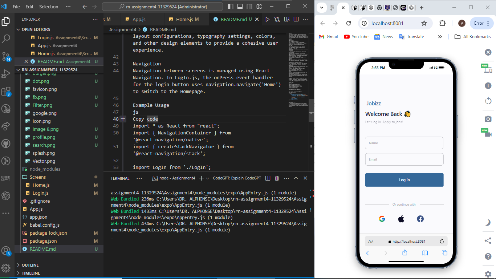
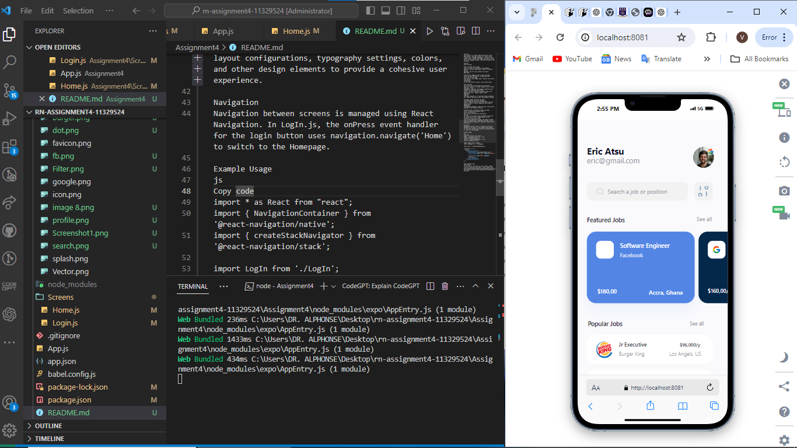

Overview
This project is a mobile application built using React Native. The app consists of a login screen (LogIn) and a homepage (Homepage). The login screen allows users to enter their email and name to log in, while the homepage displays featured and popular job listings.

Features
Log In Screen:

Email and Name input fields.
"Log in" button to navigate to the homepage.
Option to continue with Google, Apple, or another service.
Register link for users without an account.
Home Page:

Displays the logged-in user's email and name.
Lists featured and popular job opportunities.
Search bar to find jobs.
Job listings with company name, location, and salary information.
Installation
To run this project locally, follow these steps:

File Structure
The project has the following file structure:
LogIn.js: Contains the LogIn component which renders the login screen.
Homepage.js: Contains the Homepage component which renders the home page after login.
assets/: Directory containing images used in the application (e.g., Google, Apple, icons).
Components
LogIn.js
The LogIn component is a functional React component that renders the login screen. Key elements include:

TextInput fields for email and name.
TouchableOpacity button for logging in.
Links to register and continue with other services.
Various styles to ensure responsive and visually appealing UI.
Homepage.js
The Homepage component renders the main screen after logging in. Key features include:

Displaying user information (email and name).
Lists of featured and popular jobs.
Search functionality.
Job listings with detailed information.
Styling
The styles are defined using StyleSheet.create and are tailored to ensure responsiveness across different screen sizes using react-native-responsive-screen. The styles include layout configurations, typography settings, colors, and other design elements to provide a cohesive user experience.

SCREENSHOTS

Navigation
Navigation between screens is managed using React Navigation. In LogIn.js, the onPress event handler for the login button uses navigation.navigate('Home') to switch to the Homepage.

Example Usage
js
Copy code
import * as React from "react";
import { NavigationContainer } from '@react-navigation/native';
import { createStackNavigator } from '@react-navigation/stack';

import LogIn from './LogIn';
import Homepage from './Homepage';

const Stack = createStackNavigator();

const App = () => {
  return (
    <NavigationContainer>
      <Stack.Navigator initialRouteName="LogIn">
        <Stack.Screen name="LogIn" component={LogIn} />
        <Stack.Screen name="Home" component={Homepage} />
      </Stack.Navigator>
    </NavigationContainer>
  );
};

export default App;
Contribution
If you wish to contribute to this project, please fork the repository and submit a pull request with your changes. Ensure that your code adheres to the existing style and includes appropriate documentation and tests.